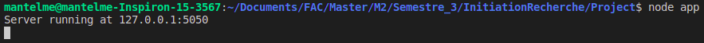

# Eye tracking visualisation alternatives

## Table of content

- [Eye tracking visualisation alternatives](#eye-tracking-visualisation-alternatives)
  - [Table of content](#table-of-content)
  - [Introduction](#introduction)
  - [Technologies](#technologies)
  - [Setup](#setup)
  - [Launch](#launch)

## Introduction

This research project aims at creating a experimentation platform that provides means to create, share and represent experimentations and their results.

Due to the current health context, we do note have access to eye-tracking hardware, therefore we will use the eye-tracking library called [Webgazer](https://github.com/brownhci/WebGazer) that provides all the tool to do some eye-tracking inside a web browser with a webcam.

## Technologies

The technologies used for this project are as follows:

- NodeJS v10.19.0
- NPM v6.14.9
  - Webgazer v2.0.1
  - Express v4.17.1
  - diff 5.0.0
  - heatmap 2.0.5
  - nouislider 14.6.3
  - stackblur-canvas 2.4.0
- Bulma 0.9.1

## Setup

Minimum requirements to run this project is to have installed NodeJS and NPM on your computer. To do so, please see the appropriate guide for yout environment of choice:

- [NodeJS](https://nodejs.org/en/download/);
- [NPM](https://docs.npmjs.com/downloading-and-installing-node-js-and-npm);

Next you need to clone this repository using the following command:

```bash
git clone git@github.com:jonas-martinez/eye-tracking.git
```

Then it is only a matter of using NPM to install the required modules using this command (in the project folder):

```bash
npm install
```

## Launch

Launching the project is quite simple, you only need to run this command in the project folder:

```bash
node app
```

If everything went well you should see this output:



> **Note:** You can change the listening address and port in the [index.js](./app/index.js) file by modifying the variables nammed `ADDRESS` and `PORT`;
